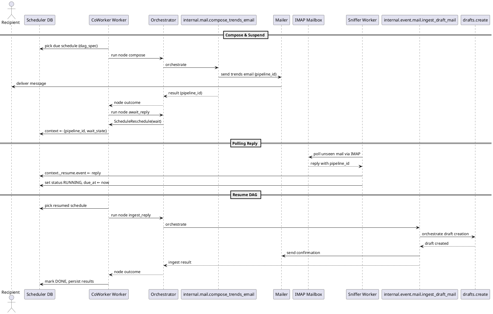

# CoWorker Email Interaction Flow

This note summarizes how the CoWorker worker handles email-driven scheduling, the technologies involved, and the control flow between services. It complements the scheduler design doc by focusing on the interactive path for persona trend emails and their replies.

## Technical Highlights

- **Flow-based DAG execution**: Each schedule stores a `dag_spec` describing an ordered list of orchestrator flows. The CoWorker worker parses this spec and executes nodes sequentially using the `DagExecutor`, persisting node outputs and resume hints in schedule context.
- **Suspend/resume semantics**: The `internal.mail.await_reply` flow raises a `request_reschedule`, keeping the schedule in `RUNNING` with a `pipeline_id` and `_resume` slot in context so the DAG can resume when an external event arrives.
- **IMAP-driven inbox polling**: The Sniffer worker polls the Naver mailbox through `poll_mailbox()` (configurable via `MAIL_IMAP_*` settings). It parses reply bodies, extracts `pipeline_id`, drops the raw message into `_resume.event`, and bumps the schedule’s `due_at` forward for immediate reprocessing.
- **Inbound ingestion flow**: When the DAG resumes, `internal.event.mail.ingest_draft_mail` receives the stored mail payload, orchestrates `drafts.create`, and sends confirmation mail without touching the scheduler state further.
- **Shared orchestrator flows**: Compose, wait, and ingest steps reuse existing orchestrator flows (`internal.mail.compose_trends_email`, `internal.mail.await_reply`, `internal.event.mail.ingest_draft_mail`) so the dynamic DAG can call familiar building blocks without bespoke runner code.

## Sequence Overview

This diagram mirrors the actual execution order: compose/send, suspend via `await_reply`, resume triggered by Sniffer, and final ingestion/closure.
