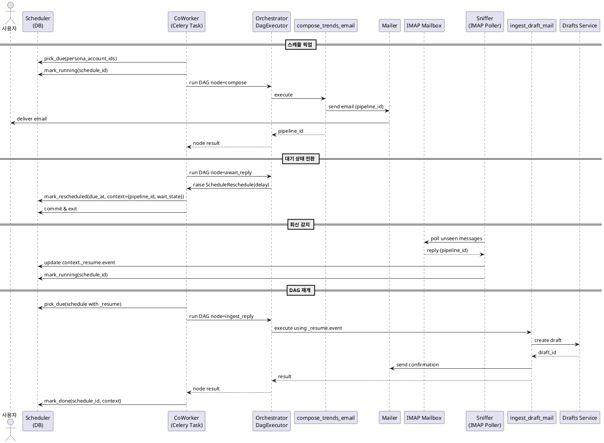

# CoWorker 이메일 상호작용 상세 설계

본 문서는 CoWorker 워커가 퍼소나 트렌드 메일 발송부터 회신 수신, 드래프트 생성 완료까지 수행하는 전체 경로를 기술적으로 정리한다. 실행 단위는 `Schedule` 레코드에 저장된 DAG 사양(`dag_spec`)이며, CoWorker는 이를 Orchestrator와 Celery를 통해 처리한다.

## 1. 구성 요소

- **Scheduler (DB + Repository)**
  - 테이블: `schedules`, `coworker_leases`
  - 역할: 실행 대상 스케줄 픽업, 상태 전이 (`PENDING → RUNNING → DONE/FAILED/RESCHEDULED`)
  - 컨텍스트 필드: `context.pipeline_id`, `context._resume`
- **CoWorker 워커 (`apps.backend.src.workers.CoWorker.execute_due_schedules`)**
  - Celery 태스크로 동작, 사용자별 lease 정보에 따라 자기 자신을 재큐잉
  - DAG 실행 전/후로 스케줄 상태 업데이트
- **Orchestrator (DSL + DagExecutor)**
  - DAG 노드 실행, `request_reschedule` 처리
  - 리소스 주입: `AsyncSession`, `User`, `persona_account_id`, `schedule_context`
- **Compose Flow (`internal.mail.compose_trends_email`)**
  - 트렌드 데이터 반영한 이메일 본문 생성 및 발송
  - 결과로 `pipeline_id` 반환
- **Await Flow (`internal.mail.await_reply`)**
  - `request_reschedule(delay=wait_timeout)` 호출, 스케줄 재예약
  - 컨텍스트에 `wait_state`, `pipeline_id` 보존
- **Sniffer 워커 (`apps.backend.src.modules.mail.service.poll_mailbox`)**
  - IMAP 폴링, 회신 메일에서 `pipeline_id` 추출
  - 해당 스케줄의 `context._resume.event` 에 메일 페이로드 저장, `due_at` 즉시로 당김
- **Ingest Flow (`internal.event.mail.ingest_draft_mail`)**
  - `_resume.event` 활용해 드래프트 생성 및 후속 알림 발송
- **Drafts 모듈 (`drafts.create`)**
  - 최종 드래프트 레코드 작성

## 2. 상태 전이 요약

| 단계 | 스케줄 상태 | 주요 컨텍스트 | 설명 |
|------|--------------|---------------|------|
| 초기 픽업 | `pending`/`failed` | `context={}` | CoWorker가 due 스케줄 잠금 |
| 실행 중 | `running` | `pipeline_id`, `wait_state` | Compose → Await 노드 실행 |
| 대기 | `running` | `_resume=None` | `request_reschedule` 로 다음 due 설정 |
| 재개 | `running` | `_resume.event` | Sniffer가 회신 적재 후 due 재설정 |
| 완료 | `done` | `context` 최신화 | Ingest 노드 성공, 결과 저장 |
| 실패 | `failed` | `last_error` | DAG 실행 예외 시 롤백 및 로그 |

## 3. 시퀀스 다이어그램

## 4. 데이터 구조 및 컨텍스트

- **Schedule.payload**: 템플릿에서 생성된 DAG 입력 (메일 제목, 트렌드 목록 등)
- **Schedule.context**:
  - `pipeline_id`: 메일-스케줄 연결 키
  - `wait_state`: `"mail_reply"` 등 대기 타입
  - `_resume.event`: 회신 메일 파싱 결과 (`subject`, `from`, `body`, 첨부 메타)
  - `_resume.ts`: 재개 트리거 타임스탬프 (선택)
- **Schedule.queue**: `coworker` (Celery 라우팅)
- **CoWorkerLease**:
  - `owner_user_id`: 사용자 단위 lease
  - `persona_account_ids`: 해당 사용자가 운용 중인 계정 목록
  - `interval_seconds`: 자기 재큐잉 주기 (최소 5초)
  - `task_id`: 최근 등록된 Celery 태스크 ID

## 5. 예외 및 재시도 전략

- DAG 노드 실행 중 예외 발생 시
  - 예외에 `__schedule_context__` 가 있으면 이를 실패 컨텍스트로 저장
  - `mark_failed` 후 Celery 태스크는 다음 스케줄로 진행
- `await_reply` 단계에서 `request_reschedule` 호출 시
  - status: `running` 유지, due_at: `effective_resume_at()`
  - payload/context 전달값이 있으면 덮어씌움 (예: 재시도용 payload)
- Sniffer가 회신을 찾지 못하면 도메인별 백오프 후 재폴링 (설정: `MAIL_IMAP_POLL_INTERVAL`)

## 6. 확장 포인트

- **멀티 채널 대응**: `pipeline_id` 추출 로직을 Slack, SMS 등으로 확장 가능
- **사용자 제어**: API `/actions/schedules/start_my_coworker`, `/actions/schedules/stop_my_coworker`로 lease 활성/비활성
- **모니터링**: 스케줄 상태 및 `updated_at` 기반으로 워커 정상 동작 감시

이 문서는 개발자가 CoWorker 상호작용 경로를 빠르게 이해하고, 문제 발생 시 추적해야 할 지점을 명확히 파악하도록 돕기 위한 레퍼런스로 사용한다.
