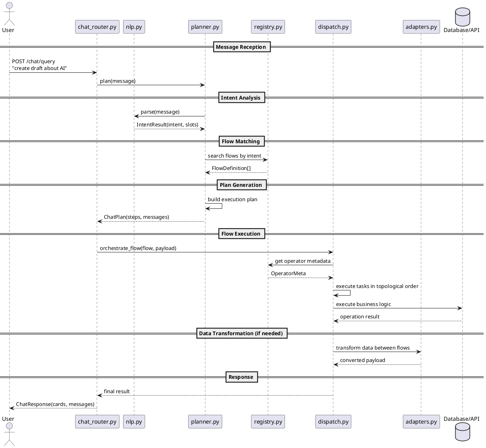
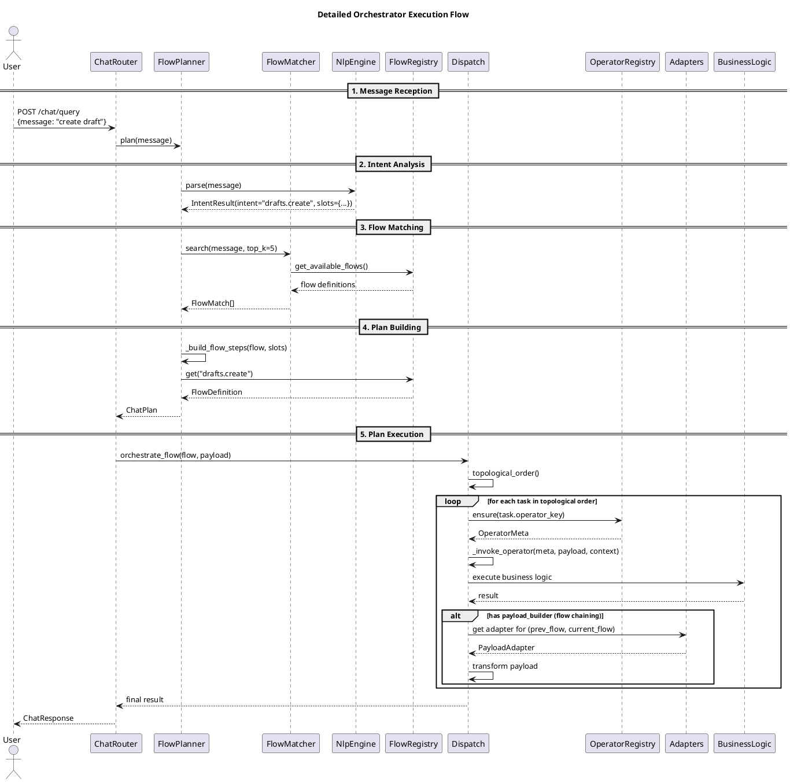
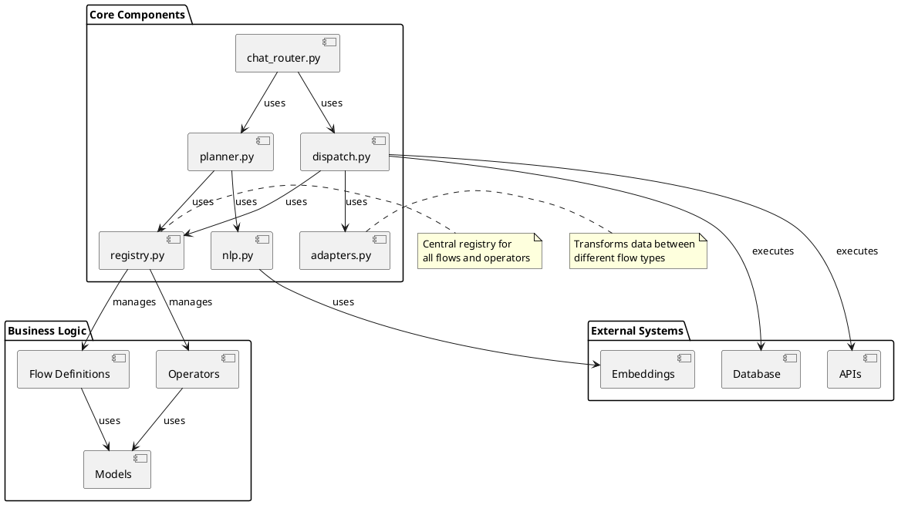

# Maestro Orchestrator Flow

## Overview

Maestro의 Orchestrator는 자연어 쿼리를 받아서 실행 가능한 작업 플랜으로 변환하고, 이를 DAG(Directed Acyclic Graph) 형태로 실행하는 시스템입니다. 채팅 기반의 인터페이스를 통해 사용자가 자연어로 요청하면, 이를 파싱하여 적절한 API 호출 시퀀스로 변환합니다.

## Core Components

### 1. chat_router.py - Entry Point
- **역할**: FastAPI 엔드포인트로 사용자 채팅 메시지를 받아서 처리
- **주요 함수**:
  - `chat_query()`: `/chat/query` 엔드포인트, 메시지를 받아서 플랜 생성 및 실행
  - `_execute_plan()`: 생성된 플랜을 실행하여 결과 반환

### 2. nlp.py - Natural Language Processing
- **역할**: 사용자 메시지에서 의도(intent)와 파라미터(slots)를 추출
- **주요 클래스**:
  - `NlpEngine`: 자연어 처리 엔진
  - `IntentResult`: 분석 결과 (intent, confidence, slots)
- **기능**:
  - 키워드 기반 intent 분류
  - 슬롯 추출 (캠페인 ID, 날짜 등)

### 3. planner.py - Plan Generation
- **역할**: NLP 결과를 바탕으로 실행 가능한 작업 플랜 생성
- **주요 클래스**:
  - `FlowPlanner`: 메인 플래너
  - `FlowMatcher`: 임베딩 + 키워드로 flow 검색
  - `ChatPlan`: 실행 플랜 (단계별 작업 정의)
- **기능**:
  - 복합 쿼리 분해 (예: "create draft and schedule post")
  - flow 매칭 및 파라미터 바인딩

### 4. registry.py - Flow & Operator Registry
- **역할**: 모든 operator와 flow를 중앙 관리
- **주요 컴포넌트**:
  - `REGISTRY`: OperatorMeta 저장
  - `FLOWS`: FlowDefinition 저장
  - `@operator` 데코레이터: operator 등록
  - `@FLOWS.flow` 데코레이터: flow 등록
- **기능**:
  - Operator/Flow 자동 발견
  - 메타데이터 관리 (input/output 모델, 설명 등)

### 5. dispatch.py - Flow Execution Engine
- **역할**: DAG 형태의 flow를 실제로 실행
- **주요 함수**:
  - `orchestrate_flow()`: flow 실행 엔트리포인트
  - `_execute_task()`: 개별 태스크 실행
- **기능**:
  - Topological sort로 실행 순서 결정
  - 의존성 관리 및 결과 전달

### 6. adapters.py - Flow Data Transformation
- **역할**: 서로 다른 flow들 사이의 데이터 변환
- **주요 기능**:
  - `FLOW_ADAPTERS`: flow 간 어댑터 매핑
  - `PayloadAdapter`: 데이터 변환 함수
- **기능**:
  - Trend → Draft 변환
  - Timeline 결과 연결 등

## Execution Flow

### 1. Message Reception (chat_router.py)
```python
@router.post("/query")
async def chat_query(payload: ChatQuery) -> ChatResponse:
    plan = await flow_planner.plan(payload.message)  # planner.py
    response = await _execute_plan(payload.message, plan, runtime)
    return response
```

### 2. Intent Analysis (nlp.py)
```python
# 메시지에서 intent와 slots 추출
intent_result = nlp_engine.parse(message)
# 예: "create campaign #123" → intent: "campaign.create", slots: {"campaign_id": 123}
```

### 3. Plan Generation (planner.py)
```python
# NLP 결과를 바탕으로 실행 플랜 생성
matches = await matcher.search(message)
plan = _build_flow_steps(flow, slots, message)
```

### 4. Flow Matching & Parameter Binding
```python
# registry에서 적절한 flow 찾기
flow = FLOWS.get("campaigns.create")

# 파라미터 모델로 변환
payload = flow.input_model(**slots)
```

### 5. Flow Execution (dispatch.py)
```python
# DAG 형태로 실행
for task_id in flow.topological_order():
    await _execute_task(task, state)
```

### 6. Operator Execution
```python
# registry에서 operator 정보 가져오기
meta = REGISTRY.ensure(task.operator_key)

# 실제 비즈니스 로직 실행
result = await _invoke_operator(meta, payload, context)
```

### 7. Data Transformation (adapters.py)
```python
# flow 간 데이터 변환 (필요시)
adapter = FLOW_ADAPTERS.get((prev_flow, next_flow))
converted_payload = adapter(previous_result, base_payload)
```

## Data Flow Example

```
User Message: "create a draft about AI trends and schedule it"

1. chat_router.py: 메시지 수신
2. nlp.py: intent="drafts.create", slots={"title": "AI trends"}
3. planner.py: "bff.drafts.create" flow 선택
4. registry.py: flow 정의와 operator 정보 제공
5. dispatch.py: flow 실행 시작
6. Operator 실행: 실제 draft 생성
7. adapters.py: 결과 변환 (필요시 다음 flow로)
8. chat_router.py: 결과 포맷팅 후 응답
```

## Key Concepts

### Flow vs Operator
- **Operator**: 개별 비즈니스 로직 단위(각 서비스 레이어로 분리된 것을 호출) (예: DB 쿼리, API 호출)
- **Flow**: Operator들을 DAG로 조합한 워크플로우

### Payload Builder
- flow 간 데이터 의존성을 해결하기 위한 어댑터
- 이전 태스크의 결과를 다음 태스크의 입력으로 변환

### Runtime Context
- 각 요청마다 필요한 리소스 (DB 연결, 사용자 정보 등) 제공
- FastAPI Dependency Injection을 통해 관리

## Error Handling

- 각 단계에서 예외 발생 시 적절한 사용자 메시지 반환
- ValidationError, LookupError 등 다양한 예외 처리
- 실패한 단계는 건너뛰고 가능한 결과 반환

## Architecture Diagram

[View as PUML file](orchestrator-flow.puml)



## Detailed Sequence Flow

[View as PUML file](detailed-sequence.puml)



## Component Relationships

[View as PUML file](component-relationships.puml)


